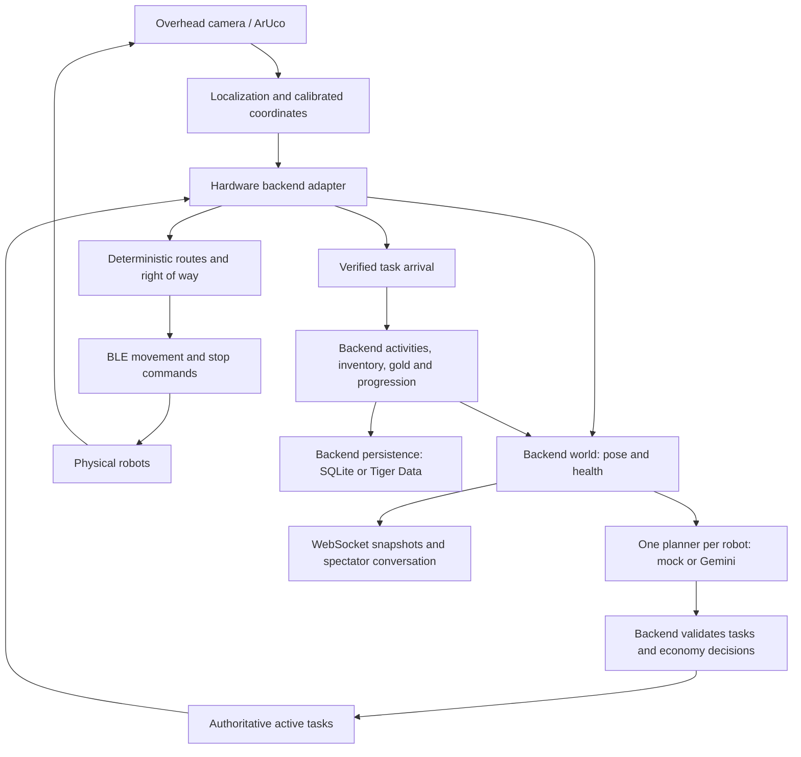

# Camera-driven agent orchestration: implementation plan

Audit date: 2026-09-27. Code baseline: main at `b62026a`, after the gameLogic merge.
This document describes **existing code and proposed next work**, not a claim that
the physical end-to-end demo has passed. No runtime behavior changes accompany
this audit.

## Goal and scope

WALL-Y and Eeva should choose useful game tasks, navigate to real service locations
using the overhead camera, complete backend-owned work, and visibly change
inventory, wallets, crops, stage progression, and conversation in the dashboard.
The full game goal is Stage 3 plus the configured combined-gold target (currently
200), not merely two agents producing plausible chat.

The next acceptance milestone is smaller: **one backend task causes real travel,
verified arrival, one game-state change, and the matching UI update**. Prove that
with mock autonomy before depending on Gemini or attempting a complete round.

Scope references reviewed: root README, PROJECT_STATUS, PROJECT_HANDOFF,
GAME_DESIGN, GAME_PLAN, CAMERA_SETUP_GUIDE, INTEGRATION, api.md, backend README,
navigation README, frontend README, and AGENTS.md. PROJECT_HANDOFF is historical;
PROJECT_STATUS and the merged code describe the newer crop/economy baseline.
Some older integration paragraphs still describe transport choices as open;
the implemented physical transport is Python/bleak with F/B/L/R/S over BLE.

## Keep the existing architecture

Agents consume structured world state; they do not need camera images every frame.
The camera determines where robots actually are. Navigation decides how to move.
The backend decides whether a task/reward is valid. Gemini never sends motor
commands, grants money, or decides whether a path is safe.

| Responsibility | Existing implementation | Remaining focus |
| --- | --- | --- |
| Marker pose | `backend/app/vision/`, navigation camera worker | Physical accuracy, frame age, heading offsets |
| BLE and discrete steering | `backend/app/robots/client.py`, `navigation/controller.py` | Measured stop behavior and deployed watchdog |
| Buildings and peer avoidance | `navigation/traffic.py`, `navigation/calibrate.py` | Service locations, waiting positions, physical clearance |
| Camera/backend connection | `navigation/backend.py`, `navigation/fleet.py` | Robust telemetry, arrivals, lifecycle and stop integration |
| Per-robot planning and chat | `agents/orchestrator.py`, `agents/runtime.py`, planner/Gemini/chat modules | Decisions grounded in physical availability and outcomes |
| Rules and task authority | `app/state.py`, API routes, simulation/activity runner | Hardware arrival and interruption checks |
| Spectator view | `frontend/src/hooks/useWorld.js`, dashboard components | Clearly show physical readiness, blocked state and outcomes |
| History | `app/persistence/` | Live Tiger verification and measured write latency |

## Work packages, in implementation order

### 1. Make game destinations match the physical arena

The bridge currently maps `world.map.locations` linearly into the calibrated arena
rectangle. Drawing building boxes does **not** place homebase, farm, lake, or market.
The setup editor currently records arena, obstacles, and robot footprints.

Extend the existing calibration workflow to place named service points in open
floor space beside buildings. Define one shared coordinate conversion for these
points and observed poses. Load the corresponding map into the hardware backend
at startup; do not maintain independent, drifting location tables in browser,
agents, and navigation. Preserve simulation defaults.

Start with the existing rectangular mapping and a fixed overhead camera. Check
alignment across the whole arena; add four-corner perspective calibration only
if measured distortion makes the rectangular mapping inadequate. Any camera
movement, crop, zoom, or resolution change requires a new calibration.

Validate each destination against robot radius, obstacle expansion, wall margin,
and route reachability before arming. For 6.2-by-5.2-inch robots, measure the actual
turning footprint in this camera view rather than assuming inches equal pixels.

Files: `navigation/calibrate.py`, `navigation/traffic.py`, `navigation/backend.py`,
backend configuration/world initialization, and the setup guide. If world fields
change, update `api.md`, models, consumers, and examples in the same change.

Acceptance: overlay all four backend destinations on the actual feed, confirm
their physical meaning, and dry-run routes to every point from both starting poses.

### 2. Make telemetry and backend authority dependable

`BackendBridge.run()` currently performs world polling, both robots' health/pose
writes, traffic chat, and arrival delivery sequentially. Each request can take
0.5 seconds while the local authority timeout is 0.75 seconds. This can cause
avoidable disarming under network/database latency; it needs measurement and
failure-injection tests, not simply a longer safety timeout.

Separate bounded telemetry/world synchronization from informational chat retries.
Use capture-time observation IDs/timestamps and send each fresh observation once;
`capture()` currently assigns a new wall timestamp even when reusing an observation.
Keep the latest sample instead of accumulating old poses. Keep local camera/BLE
stops independent of HTTP and database operations. Reject a wrong mode, missing
robot, incompatible map, or changed session with a clear stopped status.

Use existing `/pose`, `/health`, `/world`, and `/blocked` contracts. Report a
persistent task blockage with its reason and duration; the current bridge only
sends the traffic blocked boolean in health. Do not treat ordinary yielding as
a permanent fault or clear a latched fault with an unconditional heartbeat.

Files: `navigation/backend.py`, `navigation/fleet.py`; tests using a fake HTTP
transport and camera observations, including slow/failed persistence responses.

Acceptance: delayed requests, a failed chat POST, stale frames, disconnects, and
session resets cannot produce stale motion, duplicate observations, or silent
adapter failure. Failure to obtain fresh authority still stops motion.

### 3. Strengthen arrival and emergency-stop semantics

Current `TaskFollower.report_arrivals()` queues arrival after a single in-range
pose, before that frame's BLE command dispatch. `WorldStore.confirm_arrival()`
checks session/task/location and idempotency, but does not independently check
distance, fresh tracking, or game/robot stop state at acceptance.

Require fresh observations inside the configured service tolerance for a short
measured settling interval, with motion stopped, before reporting arrival.
Revalidate queued reports against the current task/session and stop state before
delivery. A BLE write acknowledgement alone is not proof of physical standstill.
Add backend hardware-mode validation against the same service geometry and
availability rules, while preserving retries of already accepted reports.

SPACE currently stops/disarms local motors but does not call the backend game-stop
route. Consequently, an already active backend activity can continue while the
local controller is disarmed and still reports healthy tracking. Stop motors
immediately, then propagate the interruption through the existing backend stop
contract asynchronously. Keep stop intent pending across HTTP failures and
require deliberate recovery; no reconnect should silently restart motion.
Distinguish an emergency stop from a normal stationary farming/fishing activity.

Files: `navigation/backend.py`, `navigation/fleet.py`, `app/state.py`, robotics and
lifecycle tests, `api.md`. Record any newly rejected arrival cases in the contract.

Acceptance: old, far-away, cancelled, stale, stopped, or wrong-session arrivals
cannot create new transactions. Arrival retries produce one result. SPACE, UI
stop, camera loss, BLE loss, and backend loss are tested during travel and activity.
Plant growth may continue independently; stopped robot work must not keep awarding
harvest/fishing rewards. Verify the ESP32 command-expiry firmware on both robots:
the archived original sketch stops on disconnect but lacks connected-host expiry.

### 4. Make shared destinations usable by both robots

Traffic currently grants one robot a movement reservation and treats its peer as
a stationary obstacle. This is a useful MVP, but an occupied market/farm target
can remain unreachable. A planned detour cannot drive into an occupied endpoint.

Add an explicit service/waiting policy: configure clear waiting or parking points,
reserve a service point, and release it after work by moving to a clear position.
Alternatively, use separate safe service bays for each robot where space permits.
Choose based on the actual arena layout; do not blindly shrink collision margins.
Backend logical location remains `market`/`farm` even if several approved bays
serve it. Arrival validation must understand those bays.

Keep deterministic right of way and bounded waiting. Add progress/stuck detection
and a clear operator-visible failure when no route is possible. Do not have an LLM
negotiate motor timing. Publish traffic decisions to chat: one robot yields, the
other acknowledges, then navigation executes the already validated reservation.
Dialogue should describe yielding rather than claim a collision was sensed;
the system has no physical contact sensor.

Files: `navigation/traffic.py`, `navigation/backend.py`, calibration/configuration,
and the existing traffic chat integration. Extend tests for both robots wanting
the same destination, an occupied destination, no route, and reservation release.

Acceptance: both robots can use the market repeatedly without operator relocation,
unsafe passing, or endless waiting. Test building detours and wall clearance with
measured speed and stopping distance before a full autonomous round.

### 5. Ground agent behavior and the UI in physical outcomes

Reuse `AutonomyRunner` and the current bounded action validation. Agents select
BUY/PLANT/HARVEST/FISH/SELL or movement tasks; cooperative economy decisions use
the existing economy service. Transfers and unlock agreements do not generate BLE
movement. Do not start a separate CLI planner alongside backend autonomy.

Include meaningful blocked/waiting/service availability in decision context as
needed. Revalidate decisions after model latency against the current session and
task state. Keep accepted intentions distinct from completed actions in chat:
“heading to market” is not “sold the wheat.” Preserve concise replies and occasional
banter, but prioritize route coordination, results, and useful task decisions.

The dashboard should visibly distinguish hardware from its local offline demo
fallback. Show camera freshness, BLE status, local armed/disarmed state, blockage
reason, active task, and confirmed completion. Armed state is not currently a
complete backend contract; add it deliberately if exposing it in the UI.
Use backend snapshots/events for every wallet and inventory change.

Acceptance: closing every browser does not stop backend planning. Reopening a
browser reconstructs the actual round. Chat alone never changes gold, and backend
connection loss cannot masquerade as successful physical gameplay.

## Backend and database deployment

Use the existing FastAPI backend, one worker, with `GAME_MODE=hardware`,
`AUTONOMY_ENABLED=true`, and `AUTONOMY_PROVIDER=mock` for the first physical pass.
The camera and BLE process must run on the laptop that can access both devices.
The backend can run there or on another reachable laptop; set navigation's
`--backend-url` and frontend's `VITE_API_BASE_URL` to that backend, and configure
the frontend origin. Keep Gemini credentials only in the backend environment.

The current command/runbook is in [CAMERA_SETUP_GUIDE.md, section 13](CAMERA_SETUP_GUIDE.md#13-hardware-backend-integration).
Adding `--backend-url` switches navigation from clicked targets to backend tasks.
Start the game and deliberately arm task following with A after readiness checks.
These commands exist today; they do not prove that the work packages above are done.

Keep persistence behind the backend. First verify the physical slice using SQLite
to isolate robot integration, then repeat with the team's Tiger Data service.
Run `app.persistence init` and `check` with the locally supplied DATABASE_URL,
then the isolated-schema persistence test with TEST_DATABASE_URL as documented
in the backend README. Measure latency at the real telemetry rate. Do not move
database calls into the camera/control loop or bypass atomic game writes.

## Verification ladder and completion criteria

1. Run the existing suite; extend bridge/arrival/stop tests before physical tests.
2. Exercise hardware-mode HTTP integration using synthetic camera observations
   and fake BLE. Verify actual API state changes, not only geometry calculations.
3. Follow existing localization → clicked geometry → command-only → controlled
   movement phases. Validate both markers, steering, calibration and watchdogs.
4. With autonomy disabled, submit one task through the backend and verify real
   arrival, exactly one result, persistence, and a live UI update.
5. With mock autonomy, complete BUY → PLANT → growth → HARVEST → SELL plus a FISH
   → SELL cycle. Check actual wallet deltas and crop/seed inventory conservation.
6. Run both robots through shared destinations; interrupt and recover every link.
7. Complete the cooperative Stage 2/3 progression and final goal. Verify motion
   stops on completion. Then repeat with Gemini and tune pacing from measured runs.

Record the commit, local calibration, camera resolution, firmware version,
provider, completed tasks, interruptions, and results for each physical rehearsal.
Do not treat mock success as Gemini verification or unit tests as hardware proof.

Audit verification: `.venv/bin/python -m unittest discover -s tests -q`
from `backend`: **218 tests run successfully, including 1 skipped**.
The skipped test requires live Tiger credentials. This audit did not connect to
cameras, BLE robots, live Gemini, or Tiger Data.

The first implementation slice should cover destination calibration plus a
single-task adapter integration test, followed immediately by arrival/stop
hardening. Keep broader UI polish, more robots, advanced planning, and additional
game mechanics behind the complete physical loop.
